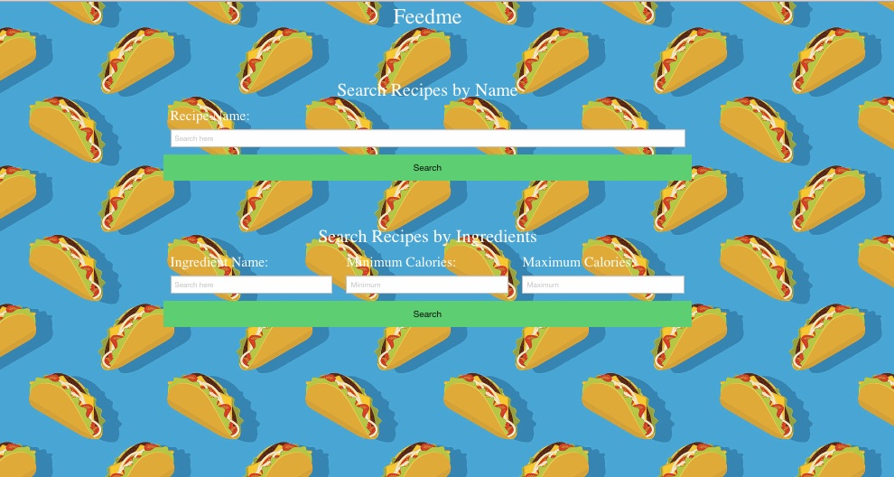
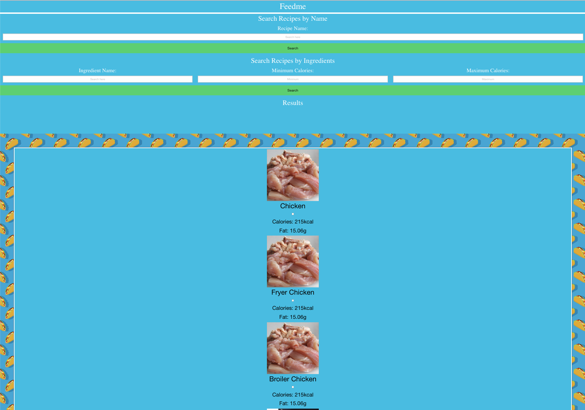
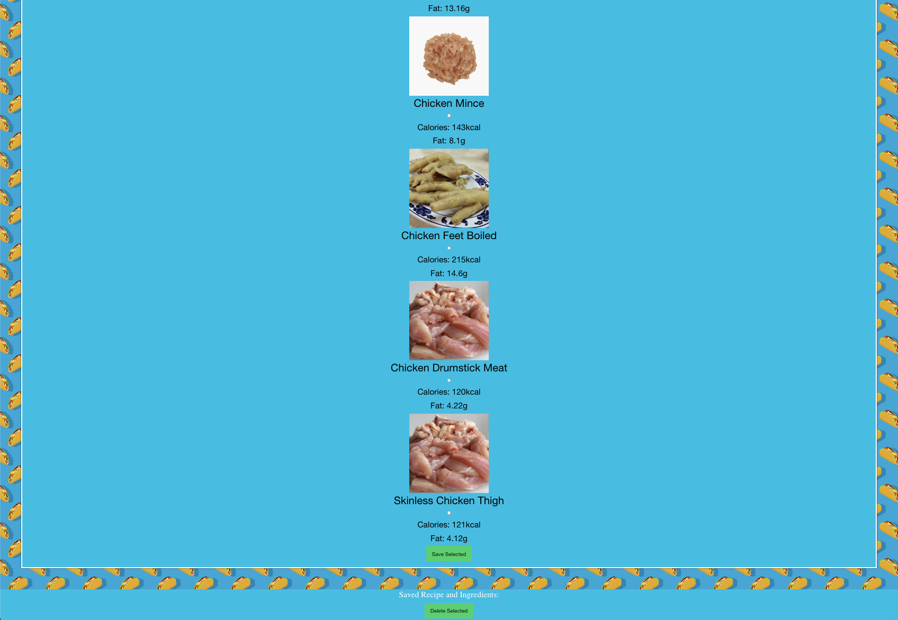

# feedme

## Techonlogies Used
During this project. I used the following techonlogies 
- Index.html 
- CSS 
- README.md 
- script.js
- Gitlab 
- Github
- Foundation Framework
- Edamam API
- ThemealDB API
- Google Fonts

## Description
 This is a basic level application used to search recipes for name and ingredients and can you see the caloric elements they have,
It’s divided in 2 parts into the coding documents, one for the home page and one for the results, Edamam api and Themealdb api are the 2 Public APIs 
we implement on this project, Edaman was used for the research of the ingredients and Themealdb was implemented for the recipes and caloric information.

## Credits
N/A

## Deployed link
https://rlee7029.github.io/feedme/